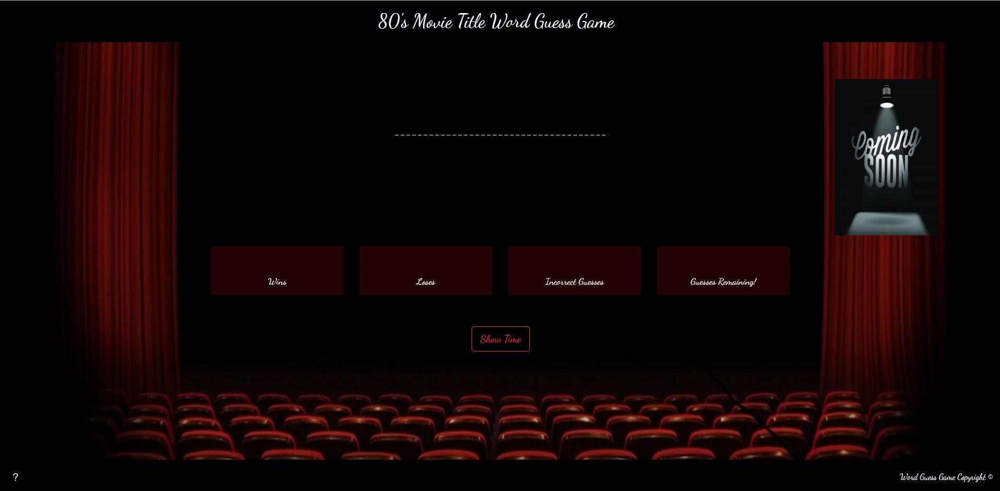

# Word Guess Game
This is a classic Word Guess Game based on 1980's Movie Titles. When the "Show Time" button is clicked, the guessing begins! Press any one of the 26 alpha characters on the keyboard. If you chose correctly, the letter  will appear on the gameboard. If you chose incorrectly, then the letter will appear in the Incorrect Guess Box and you will lose a guess. Careful! You only get 12 guesses before you lose the round. 

## Link to the App
["Guess Away!"](https://dustinmcgilvray.github.io/Word-Guess-Game/)

## Crafted With
* HTML5
* CSS3
* [Visual Studio Code](https://code.visualstudio.com/)
* JavaScript
* [Bootstrap](https://getbootstrap.com/)
* [Google Font](https://fonts.google.com/)

## Acknowledgements
* Shout out to my wife, Adrienne, for her amazing knowledge of 1980's movie titles!

## Author
* Dustin McGilvray
